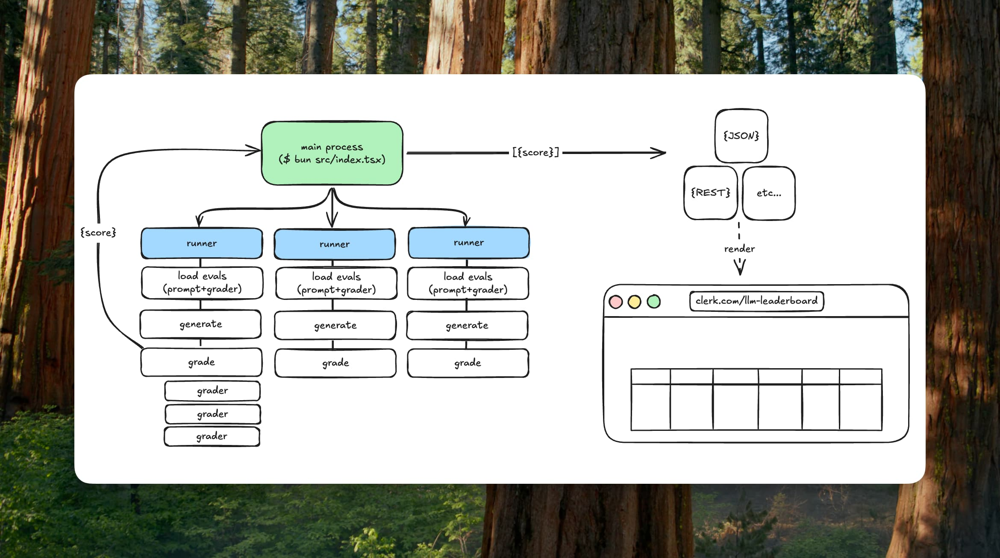

# clerk-evals

A project to enable easy testing of prompts against various provider LLMs.



## Quickstart

Install [Bun](https://bun.sh) `>=1.3.0`, then gather the required API keys. See [`.env.example`](./.env.example)

```bash
cp .env.example .env
```

Run the eval suite (might take about 50s)

```bash
bun i
bun start
```

<details>
<summary>Example scores</summary>

```json
[
  {
    "model": "gpt-5-chat-latest",
    "framework": "Next.js",
    "category": "Fundamentals",
    "value": 0.6666666666666666,
    "updatedAt": "2025-10-15T17:51:27.901Z"
  },
  {
    "model": "gpt-4o",
    "framework": "Next.js",
    "category": "Fundamentals",
    "value": 0.3333333333333333,
    "updatedAt": "2025-10-15T17:51:30.871Z"
  },
  {
    "model": "claude-sonnet-4-0",
    "framework": "Next.js",
    "category": "Fundamentals",
    "value": 0.5,
    "updatedAt": "2025-10-15T17:51:56.370Z"
  },
  {
    "model": "claude-sonnet-4-5",
    "framework": "Next.js",
    "category": "Fundamentals",
    "value": 0.8333333333333334,
    "updatedAt": "2025-10-15T17:52:03.349Z"
  },
  {
    "model": "v0-1.5-md",
    "framework": "Next.js",
    "category": "Fundamentals",
    "value": 1,
    "updatedAt": "2025-10-15T17:52:06.700Z"
  },
  {
    "model": "claude-opus-4-0",
    "framework": "Next.js",
    "category": "Fundamentals",
    "value": 0.5,
    "updatedAt": "2025-10-15T17:52:06.898Z"
  },
  {
    "model": "gpt-5",
    "framework": "Next.js",
    "category": "Fundamentals",
    "value": 0.5,
    "updatedAt": "2025-10-15T17:52:07.038Z"
  }
]
```

</details>

**Debuging**

```bash
# Run a single evaluation
bun run start:eval evals/002-apiroutes

# Run in debug mode
bun run start --debug

# Run a single evaluation in debug mode
bun run start:eval evals/002-apiroutes --debug
```

## Overview

This project is broken up into a few core pieces:

- [`src/index.ts`](./src/index.ts): This is the main entrypoint of the project. Evaluations, models, reporters, and the runner are registered here, and all executed.
- [`/evals`](./src/evals): Folders that contain a prompt and grading expectations. Runners currently assume that eval folders contain two files: `graders.ts` and `PROMPT.md`.
- [`/runners`](./src/runners): The primary logic responsible for loading evaluations, calling provider llms, and outputting scores.
- [`/reporters`](./src/reporters): The primary logic responsible for sending scores somewhere — stdout, a file, etc.

### Running

A **runner** takes a simple object as an argument:

```jsonc
{
  "provider": "openai",
  "model": "gpt-5",
  "evalPath": "/absolute/path/to/clerk-evals/src/evals/000-basic-nextjs
}
```

It will resolve the provider and model to the respective SDK.

It will load the designated **evaluation**, generate LLM text from the prompt, and pass the result to graders.

### Evaluations

At the moment, **evaluations** are simply folders that contain:

- `PROMPT.md`: the instruction for which we're evaluating the model's output on
- `graders.ts`: a module containing grader functions which return `true/false` signalling if the model's output passed or failed. This is essentially our acceptance criteria.

### Graders

Shared grader primitives live in [`src/graders/index.ts`](./src/graders/index.ts). Use them to declare new checks with a consistent, terse shape:

```ts
import { contains, defineGraders, judge } from '@/src/graders'
import { llmChecks } from '@/src/graders/catalog'

export const graders = defineGraders({
  references_middleware: contains('middleware.ts'),
  package_json: llmChecks.packageJsonClerkVersion,
  custom_flow_description: judge(
    'Does the answer walk through protecting a Next.js API route with Clerk auth() and explain the response states?',
  ),
})
```

- `contains` / `containsAny`: case-insensitive substring checks by default
- `matches`: regex checks
- `judge`: thin wrappers around the LLM-as-judge scorer. Shared prompts live in [`src/graders/catalog.ts`](./src/graders/catalog.ts); add new reusable prompts there.
- `defineGraders`: preserves type inference for the exported `graders` record.

### Score

For a given model, and evaluation, we'll retrieve a score from `0..1`, which is the percentage of grader functions that passed.

### Reporting

At the moment, we employ two minimal **reporters**

- [console](./src/reporters/console.ts): writes scores via `console.log()`
- [file](./src/reporters/file.ts): saves scores to a gitignored `scores.json` file.

### Interfaces

For the notable interfaces, see [`/interfaces`](./src/interfaces/index.ts).
