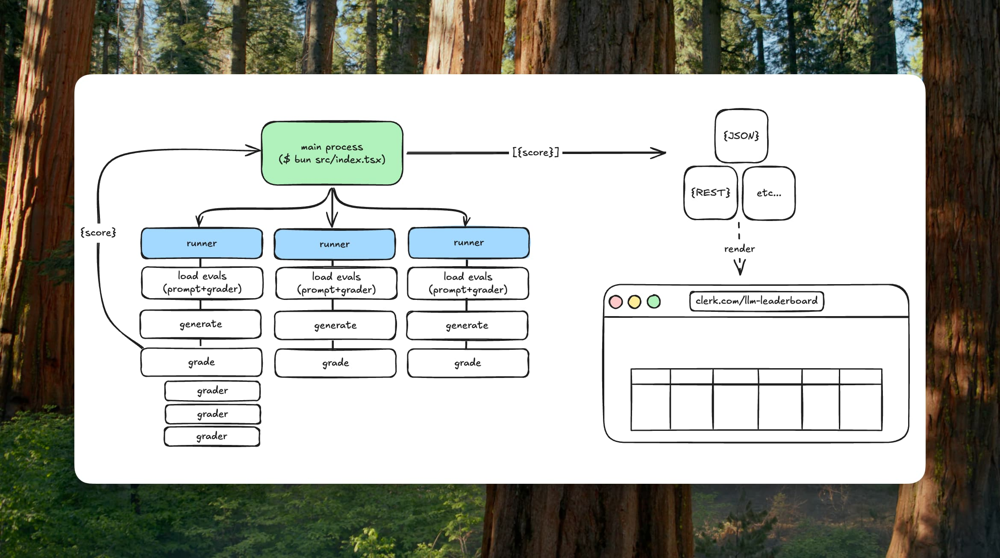

# openfort-evals

This repository hosts evaluation suites to test how well LLMs write Openfort code (wallets, transactions, fee sponsorship, etc.). To add a new eval, create a folder under `src/evals/` with a `PROMPT.md` and `graders.ts`, then register it in `src/config/evaluations.ts`.



## Quickstart

Install [Bun](https://bun.sh) `>=1.3.0`, then gather the required API keys. See [`.env.example`](./.env.example)

```bash
cp .env.example .env
```

Run the eval suite (might take about 50s)

```bash
bun i
bun start
```

## Add a new evaluation

For detailed, copy-pastable steps see [`docs/ADDING_EVALS.md`](./docs/ADDING_EVALS.md). In short:

- Create `src/evals/your-eval/` with `PROMPT.md` and `graders.ts`.
- Implement graders that return booleans using `defineGraders(...)` and shared judges in `@/src/graders/catalog`.
- Append an entry to the `evaluations` array in `src/config/evaluations.ts` with `framework`, `category`, and `path` (e.g., `evals/wallets/create`).
- Run `bun run start:eval src/evals/your-eval` (optionally `--debug`).

<details>
<summary>Example scores</summary>

```json
[
  {
    "model": "claude-sonnet-4-5",
    "framework": "Next.js",
    "category": "Embedded Wallets",
    "value": 0.8333333333333334,
    "updatedAt": "2026-01-06T17:51:27.901Z"
  },
  {
    "model": "gpt-5-chat-latest",
    "framework": "Next.js",
    "category": "Sponsor Transactions",
    "value": 0.6666666666666666,
    "updatedAt": "2026-01-06T17:51:30.871Z"
  }
]
```

</details>

**Debugging**

```bash
# Run a single evaluation
bun run start:eval evals/wallets/create

# Run in debug mode
bun run start --debug

# Run a single evaluation in debug mode
bun run start:eval evals/wallets/create --debug
```

## CLI Usage

```bash
bun start [options]
```

| Flag | Description |
|------|-------------|
| `--mcp` | Enable MCP tools (set `MCP_SERVER_URL_OVERRIDE` to use MCP tools) |
| `--model "claude-sonnet-4-0"` | Filter by exact model name (case-insensitive) |
| `--eval "wallets"` | Filter evals by category or path |
| `--debug` | Save outputs to debug-runs/ |

```bash
# Baseline (no tools)
bun start --model "claude-sonnet-4-0" --eval "wallets"

# With MCP tools
bun start --mcp --model "claude-sonnet-4-0" --eval "wallets"

# Local MCP server
MCP_SERVER_URL_OVERRIDE=http://localhost:8787/mcp bun start --mcp
```

## Agent Evals

Run evaluations using AI coding agents (Claude Code) instead of direct LLM calls:

```bash
bun start:agent --agent claude-code [options]
```

| Flag | Description |
|------|-------------|
| `--agent, -a` | Agent type (required): `claude-code` |
| `--mcp` | Enable MCP tools |
| `--eval, -e` | Filter evals by path |
| `--debug, -d` | Save outputs to debug-runs/ |
| `--timeout, -t` | Timeout per eval (ms) |

**Shortcuts:**

```bash
bun agent:claude        # claude-code baseline
bun agent:claude:mcp    # claude-code with MCP
```

**Examples:**

```bash
# Run all evals with Claude Code
bun start:agent --agent claude-code

# Run specific eval with debug output
bun start:agent -a claude-code -e wallets/create -d

# Run with MCP tools enabled
bun start:agent --agent claude-code --mcp
```

### Output Files

| Runner | Output | Description |
|--------|--------|-------------|
| `bun start` | `scores.json` | Baseline scores (no tools) |
| `bun start:mcp` | `scores-mcp.json` | MCP scores (with tools) |
| `bun start:agent` | `agent-scores.json` | Agent evaluation scores |
| `bun merge-scores` | `llm-scores.json` | Combined for llm-leaderboard |

### Workflow for llm-leaderboard

```bash
bun start              # 1. Baseline -> scores.json
bun start --mcp        # 2. MCP -> scores-mcp.json
bun merge-scores       # 3. Merge -> llm-scores.json
```

The merge script combines both score files and calculates improvement metrics:

```json
{
  "model": "claude-sonnet-4-5",
  "label": "Claude Sonnet 4.5",
  "framework": "Next.js",
  "category": "Embedded Wallets",
  "value": 0.83,
  "provider": "anthropic",
  "mcpScore": 0.95,
  "improvement": 0.12
}
```

## Overview

This project is broken up into a few core pieces:

- [`src/index.ts`](./src/index.ts): This is the main entrypoint of the project. Models, reporters, and the runner are registered here, and all executed. Evaluations are defined in [`src/config/evaluations.ts`](./src/config/evaluations.ts).
- [`/evals`](./src/evals): Folders that contain a prompt and grading expectations. Runners currently assume that eval folders contain two files: `graders.ts` and `PROMPT.md`.
- [`/runners`](./src/runners): The primary logic responsible for loading evaluations, calling provider llms, and outputting scores.
- [`/reporters`](./src/reporters): The primary logic responsible for sending scores somewhere — stdout, a file, etc.

### Running

A **runner** takes a simple object as an argument:

```jsonc
{
  "provider": "openai",
  "model": "gpt-5",
  "evalPath": "/absolute/path/to/openfort-evals/src/evals/wallets/create"
}
```

It will resolve the provider and model to the respective SDK.

It will load the designated **evaluation**, generate LLM text from the prompt, and pass the result to graders.

### Evaluations

At the moment, **evaluations** are simply folders that contain:

- `PROMPT.md`: the instruction for which we're evaluating the model's output on
- `graders.ts`: a module containing grader functions which return `true/false` signalling if the model's output passed or failed. This is essentially our acceptance criteria.

### Graders

Shared grader primitives live in [`src/graders/index.ts`](./src/graders/index.ts). Use them to declare new checks with a consistent, terse shape:

```ts
import { contains, defineGraders, judge } from '@/src/graders'
import { llmChecks } from '@/src/graders/catalog'

export const graders = defineGraders({
  references_openfort: contains('@openfort/openfort-node'),
  openfort_deps: llmChecks.packageJsonOpenfortDeps,
  custom_flow_description: judge(
    'Does the answer walk through creating an embedded wallet with Openfort and explain the key steps?',
  ),
})
```

- `contains` / `containsAny`: case-insensitive substring checks by default
- `matches`: regex checks
- `judge`: thin wrappers around the LLM-as-judge scorer. Shared prompts live in [`src/graders/catalog.ts`](./src/graders/catalog.ts); add new reusable prompts there.
- `defineGraders`: preserves type inference for the exported `graders` record.

### Score

For a given model, and evaluation, we'll retrieve a score from `0..1`, which is the percentage of grader functions that passed.

### Reporting

At the moment, we employ two minimal **reporters**

- [console](./src/reporters/console.ts): writes scores via `console.log()`
- [file](./src/reporters/file.ts): saves scores to a gitignored `scores.json` file.

### Interfaces

For the notable interfaces, see [`/interfaces`](./src/interfaces/index.ts).
