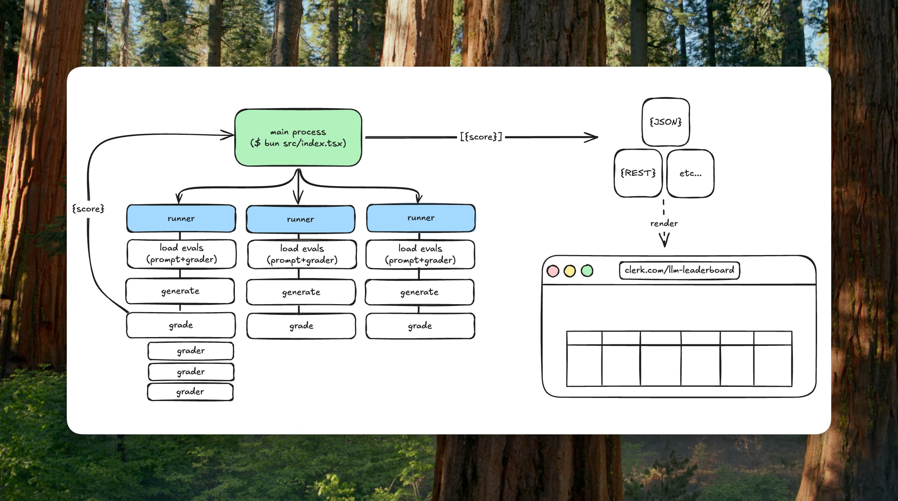

# clerk-evals

Evaluation suites for testing how language models and coding agents write Clerk code. The suite covers 37 tasks across Next.js, React, iOS, and Android. Vercel AI Gateway provides one transport for models from OpenAI, Anthropic, Google, xAI, Moonshot AI, and Tencent.



## Quickstart

Install [Bun](https://bun.sh) `>=1.3.0`, then add a Vercel AI Gateway key. See [`.env.example`](./.env.example).

```bash
cp .env.example .env
bun i
bun start
```

## Add a new evaluation

For detailed, copy-pastable steps see [`docs/ADDING_EVALS.md`](./docs/ADDING_EVALS.md). In short:

- Create `src/evals/your-eval/` with `PROMPT.md` and `graders.ts`.
- Implement graders that return booleans using `defineGraders(...)` and shared judges in `@/src/graders/catalog`.
- Append an entry to the `evaluations` array in `src/config/evaluations.ts` with `framework`, `category`, and `path`.
- Run `bun start --eval "your-eval" --smoke --debug` to test with one model.

<details>
<summary>Example scores</summary>

```json
[
  {
    "model": "claude-sonnet-4-5",
    "framework": "Next.js",
    "category": "Auth",
    "value": 0.8333333333333334,
    "updatedAt": "2026-01-06T17:51:27.901Z"
  },
  {
    "model": "gpt-5-chat-latest",
    "framework": "Next.js",
    "category": "Auth",
    "value": 0.6666666666666666,
    "updatedAt": "2026-01-06T17:51:30.871Z"
  },
  {
    "model": "claude-opus-4-5",
    "framework": "Next.js",
    "category": "Billing",
    "value": 1.0,
    "updatedAt": "2026-01-06T17:51:56.370Z"
  }
]
```

</details>

**Debugging**

```bash
# Run a single evaluation with debug output
bun start --eval "auth/routes" --debug

# Smoke test (one model, one eval)
bun start --eval "auth/routes" --smoke --debug
```

## CLI Usage

```bash
bun start [options]
```

| Flag                     | Description                                                  |
| ------------------------ | ------------------------------------------------------------ |
| `--mcp`                  | Enable MCP tools (uses mcp.clerk.dev by default)             |
| `--skills`               | Enable skills tools (loads from `../skills/skills/`)         |
| `--model "grok-4.6"`     | Select an exact model; explicit selection can use old models |
| `--provider "anthropic"` | Filter by model creator                                      |
| `--include-legacy`       | Include catalog models that do not meet the default policy   |
| `--eval "protect"`       | Filter evals by category or path                             |
| `--debug`                | Collect debug details and print the score report             |
| `--dry`                  | Print task summary without running                           |
| `--smoke`                | Run only the first task                                      |
| `--fail-under 70`        | Fail if the average is below the percentage threshold        |

```bash
# Baseline (no tools)
bun start --model "grok-4.6" --eval "protect"

# With MCP tools
bun start --mcp --model "claude-sonnet-5" --eval "protect"

# With skills
bun start --skills --model "claude-sonnet-4-5"

# Local MCP server
MCP_SERVER_URL_OVERRIDE=http://localhost:8787/mcp bun start --mcp

# Dry run (see what would execute)
bun start --dry
```

### Model policy

Routine runs include models released in the last 90 days. A creator's model marked as its current best model remains in routine runs after 90 days. An exact `--model` selection always works for models that remain in the catalog. Use `--include-legacy` to run the complete catalog.

The external model set also tracks strong results from the [Convex LLM leaderboard](https://www.convex.dev/llm-leaderboard). The current additions are Grok 4.6, Grok 4.5, Tencent Hy4 Preview, and Kimi K3. These models ranked 4, 8, 9, and 13 when selected on September 3, 2026.

### Batch Runner

Run all configured models sequentially with timeout and retry:

```bash
./run-evals.sh                              # Default models, baseline + MCP
./run-evals.sh --models "gpt-5,claude-sonnet-4-5"  # Specific models
./run-evals.sh --include-legacy             # Complete catalog
./run-evals.sh --baseline-only              # Skip MCP
./run-evals.sh --mcp-only                   # Skip baseline
./run-evals.sh --list                       # List available models
```

### Braintrust Integration

Set `BRAINTRUST_API_KEY` to enable experiment logging and tracing:

```bash
# Single run: creates experiment automatically
BRAINTRUST_API_KEY=sk-... bun start --mcp

# Batch run: defers reporting, consolidates into one experiment per mode
BRAINTRUST_API_KEY=sk-... ./run-evals.sh

# Manual consolidated report from recent results
BRAINTRUST_API_KEY=sk-... bun report:braintrust --since "2026-03-19T17:00:00Z"
```

The eval runner uses `wrapAISDK` to auto-trace all `generateText` calls (inputs, outputs, tool invocations, token usage). Traces flow to Braintrust even during batch runs.

## Coding-agent evals

Run evaluations using AI coding agents (Claude Code, Codex) instead of direct LLM calls.

### Prerequisites

Agent evals spawn CLI tools as child processes and grade the final isolated workspace. Install a supported CLI before running:

- [Claude Code](https://code.claude.com/docs/en/quickstart)
- [Codex CLI](https://developers.openai.com/codex/cli)

Set `VERCEL_AI_GATEWAY_API_KEY` in `.env`. The harness maps this key to each CLI. Direct provider keys remain a fallback for local compatibility. Pin the model with `--model` or `ANTHROPIC_MODEL` for Claude Code and `OPENAI_MODEL` for Codex.

Registered agent tasks use an explicit repository fixture. A task can also define hidden Bun tests. The harness stages those tests outside the repository after the coding agent exits. Test failure is a hard score gate, while normal deterministic graders still provide diagnostic partial credit.

### Usage

```bash
bun start:agent --agent claude-code --model claude-sonnet-5 [options]
```

| Flag            | Description                                      |
| --------------- | ------------------------------------------------ |
| `--agent, -a`   | Agent type (required): `claude-code`, `codex`    |
| `--model, -m`   | Exact model ID (required unless set by env)      |
| `--mcp`         | Enable MCP tools                                 |
| `--eval, -e`    | Filter evals by path                             |
| `--debug, -d`   | Collect debug details and print the score report |
| `--timeout, -t` | Timeout per eval (ms)                            |

**Shortcuts:**

```bash
bun agent:claude --model claude-sonnet-5
bun agent:claude:mcp --model claude-sonnet-5
bun agent:codex --model gpt-5.6-sol
```

**Examples:**

```bash
# Run all evals with Claude Code
bun start:agent --agent claude-code --model claude-sonnet-5

# Run specific eval with debug output
bun start:agent -a claude-code -m claude-sonnet-5 -e add-auth -d

# Run with MCP tools enabled
bun start:agent --agent codex --model gpt-5.6-sol --mcp
```

### Output Files

| Runner                  | Output               | Description                      |
| ----------------------- | -------------------- | -------------------------------- |
| `bun start`             | `scores.json`        | Baseline scores (no tools)       |
| `bun start --mcp`       | `scores-mcp.json`    | MCP scores (with tools)          |
| `bun start --skills`    | `scores-skills.json` | Skills scores                    |
| `bun start:agent`       | `agent-scores.json`  | Agent evaluation scores          |
| `bun merge-scores`      | `llm-scores.json`    | Combined for llm-leaderboard     |
| `bun report:braintrust` | Braintrust UI        | Consolidated experiment per mode |

### Workflow for llm-leaderboard

```bash
bun start              # 1. Baseline -> scores.json
bun start --mcp        # 2. MCP -> scores-mcp.json
bun merge-scores       # 3. Merge -> llm-scores.json
```

The merge script combines both score files and calculates improvement metrics:

```json
{
  "model": "claude-sonnet-4-5",
  "label": "Claude Sonnet 4.5",
  "framework": "Next.js",
  "category": "Auth",
  "value": 0.83,
  "provider": "anthropic",
  "mcpScore": 0.95,
  "improvement": 0.12
}
```

## Overview

This project is broken up into a few core pieces:

- [`src/index.ts`](./src/index.ts): This is the main entrypoint of the project. Models, reporters, and the runner are registered here, and all executed. Evaluations are defined in [`src/config/evaluations.ts`](./src/config/evaluations.ts).
- [`/evals`](./src/evals): Folders that contain a prompt and grading expectations. Runners currently assume that eval folders contain two files: `graders.ts` and `PROMPT.md`.
- [`/runners`](./src/runners): The primary logic responsible for loading evaluations, calling provider llms, and outputting scores.
- [`/reporters`](./src/reporters): The primary logic responsible for sending scores somewhere — stdout, a file, etc.

### Running

A **runner** takes a simple object as an argument:

```jsonc
{
  "provider": "openai",
  "model": "gpt-5",
  "evalPath": "/absolute/path/to/clerk-evals/src/evals/auth/protect",
}
```

It will resolve the provider and model to the respective SDK.

It will load the designated **evaluation**, generate LLM text from the prompt, and pass the result to graders.

### Evaluations

At the moment, **evaluations** are simply folders that contain:

- `PROMPT.md`: the instruction for which we're evaluating the model's output on
- `graders.ts`: a module containing grader functions which return `true/false` signalling if the model's output passed or failed. This is essentially our acceptance criteria.

### Graders

Shared grader primitives live in [`src/graders/index.ts`](./src/graders/index.ts). Use them to declare new checks with a consistent, terse shape:

```ts
import { contains, defineGraders, judge } from '@/src/graders'
import { llmChecks } from '@/src/graders/catalog'

export const graders = defineGraders({
  references_middleware: contains('middleware.ts'),
  package_json: llmChecks.packageJsonClerkVersion,
  custom_flow_description: judge(
    'Does the answer walk through protecting a Next.js API route with Clerk auth() and explain the response states?',
  ),
})
```

- `contains` / `containsAny`: case-insensitive substring checks by default
- `matches`: regex checks
- `judge`: thin wrappers around the LLM-as-judge scorer. Shared prompts live in [`src/graders/catalog.ts`](./src/graders/catalog.ts); add new reusable prompts there.
- `defineGraders`: preserves type inference for the exported `graders` record.

### Score

For a given model, and evaluation, we'll retrieve a score from `0..1`, which is the percentage of grader functions that passed.

### Reporting

Three reporters:

- [console](./src/reporters/console.ts): color-coded ASCII table (category x model matrix)
- [file](./src/reporters/file.ts): saves scores to `scores.json` / `scores-mcp.json` / `scores-skills.json`
- [braintrust](./src/reporters/braintrust.ts): logs experiments to Braintrust (opt-in via `BRAINTRUST_API_KEY`)

For batch runs, [`src/report-braintrust.ts`](./src/report-braintrust.ts) consolidates all per-model results from SQLite into a single experiment per mode.

### Interfaces

For the notable interfaces, see [`/interfaces`](./src/interfaces/index.ts).
